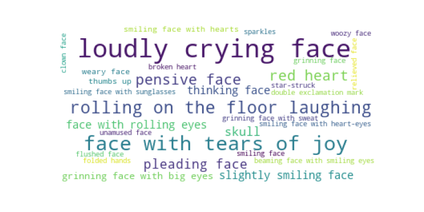

# Math Unsupervised

Find Blog post [here](https://towardsdatascience.com/math-unsupervised-a3667b6ec9b8).

Throughout my many years in math education as a tutor and as a teacher, one thing that consistently stood out to me was that my students almost always had strong feelings about math. I wondered if this phenomenon extended beyond my students. This led me to my goal of seeing how do people talk about math.

My expectation going into this project was that I was going to see a lot of hate for math.

**Tools used:** tweepy, pandas, NLTK, googletrans, wordcloud, emoji, demoji, pyLDAvis

**Algorithms Considered (topic modeling, dimensionality reduction, clustering):**  NMF, LSA, LDA, SVD, PCA, K-Means clustering

**Sentiment Analysis:** VADER

# Methodology
This project was completed through an iterative process. I began with minimal data processing and continuously improved upon it. Early iterations can be found in the appendix.

# Data Collection

My data source was 9,000 tweets with the keyword math scraped using tweepy.

[Data Collection](https://github.com/Neda-Sal/Twitter_on_Math/blob/main/data_collection_twitter.ipynb)

# Data Processing

I used the google translate API to translate any non english tweets, then removed any non english characters that did not get translated, and dropped duplicates tweets. Next, I removed special characters, and emojis.

In the first iteration I had converted the emojis into words so that I could perhaps include them in my analysis. The topics turned out to not be as interpretable when I included the emojis, so I elected to remove them in the next iteration.

Here is my [Data Processing notebook](https://github.com/Neda-Sal/Twitter_on_Math/blob/main/data_proc2.ipynb) which depends on this [data preprocessing module](https://github.com/Neda-Sal/Twitter_on_Math/blob/main/preprocess.py).

# Vectorization and Topic Modeling

I considered CountVectorizer, and  TF-IDF Vectorizer, with NMF, LSA, and LDA. I found that the TF-IDF Vectorizer along with Non-negative Matrix Factorization, (NMF), gave me the most interpretable topics. 

[NMF Topic Modeling Notebook](https://github.com/Neda-Sal/Twitter_on_Math/blob/main/Second_iteration.ipynb). 

The notebooks for the other methods can be found in the appendix.

# Results

Based on my domain knowledge, I had expected some of the topics that appeared, however, there were other surprising topics that I did not anticipate at first. Here are some of the topics NMF uncovered, with the common words associated with these topics:

### Expected

**Bad at math:** 'bad', 'grade', 'fumbles'  

**Math teacher:** 'teacher', 'grades', 'test'  

**Hate math:** 'hate', 'crying', 'stressed'  

### Did not expect

**Love math:** 'love', 'test', 'super', 'enjoy'  

**Pay for HW:** 'pay', 'calculus', 'assignment'

Beyond these, there were also meme formats that used the word math, and topics that showed how challenging someone's math skills is commonly used to insult others. This was particularly interesting to see during the election. Here's the topic freqency in number of tweets.

# Sentiment Analysis

I gave each tweet a topic label by the max topic score it fell in. Then I used VADER for sentiment analysis and looked at a few of the average topic sentiments. For example, here's the distribution of sentiment scores for the topic on hating math. It has a mean sentiment score of -0.41.

[Labels and Sentiment Analysis Notebook](https://github.com/Neda-Sal/Twitter_on_Math/blob/main/EDA_and_sentiment_analysis.ipynb)

# Presentation

[Final Presentation Slidedeck](https://github.com/Neda-Sal/Twitter_on_Math/blob/main/Math_unsupervised_presentation.pdf)

## Appendix

[First Iteration NMF](https://github.com/Neda-Sal/Twitter_on_Math/blob/main/First_iteration.ipynb)

[First Iteration LDA](https://github.com/Neda-Sal/Twitter_on_Math/blob/main/LDA_Topic_Modeling.ipynb)

[First Iteration LSA](https://github.com/Neda-Sal/Twitter_on_Math/blob/main/try_LSA.ipynb)

[K-Means Clustering on NMF topics](https://github.com/Neda-Sal/Twitter_on_Math/blob/main/kmeans_clustering.ipynb)

[PCA Visualization](https://github.com/Neda-Sal/Twitter_on_Math/blob/main/PCA_vis.ipynb)

[Emoji WordCloud](https://github.com/Neda-Sal/Twitter_on_Math/blob/main/Emoji_EDA.ipynb)

